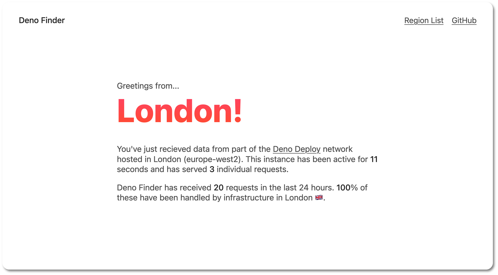

# Deno Finder

[Deno Deploy](https://deno.com/deploy) deploys your code at multiple edge regions.

This tool returns the name of [your nearest Deno Deploy edge region](https://deno.com/deploy/docs/regions). **To see this is action try using this tool whilst connected to a VPN!**

> During normal operation you may recieve data from other regions in the Deno Deploy network due to traffic demands or downtime.

## Local Development

This tool is built with [Eta](https://eta.js.org/) and [Hono](https://hono.dev/).

- Dev Server - `deno task dev`
